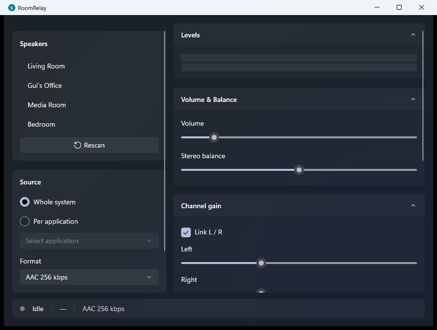

# RoomRelay

[](https://github.com/guicn555/RoomRelay/releases)
[](LICENSE)
[](https://dotnet.microsoft.com/)
[](https://learn.microsoft.com/windows/apps/windows-app-sdk/)

RoomRelay is an open-source Windows app for streaming system audio or a
single application's audio to Sonos speakers on your local network.

It is built for the gap Sonos does not cover directly on Windows: live PC
audio from browsers, music apps, games, calls, media players, or any other
audio source that Windows can capture. It works best for music, podcasts,
radio, and background audio where a small network buffer is acceptable.



## Download

Download the latest release from the [releases page](https://github.com/guicn555/RoomRelay/releases/latest):

- **Windows x64** (Intel/AMD): installer (`RoomRelay-Setup-…-win-x64-full.exe`) or
  portable ZIP (`RoomRelay-…-win-x64-full.zip`).
- **Windows on ARM** (Snapdragon, Surface Pro X, etc.): installer
  (`RoomRelay-Setup-…-win-arm64-full.exe`) or portable ZIP
  (`RoomRelay-…-win-arm64-full.zip`).
- A `-light` variant of each is also published; it omits the bundled Windows App
  Runtime and requires the matching framework package to be installed separately.
- `SHA256SUMS.txt` lists checksums for every artifact.

The full release build bundles the app and .NET runtime. It uses the installed
Windows App Runtime framework package on Windows.

## Why RoomRelay?

Sonos supports many music services directly, and Windows Media Player can
cast media-library files to Sonos, but live Windows system/app audio is still
awkward. RoomRelay gives that use case a native, open-source Windows app.

| Option | Windows live system audio | Per-app audio | Open source | Notes |
|---|---:|---:|---:|---|
| **RoomRelay** | Yes | Yes | Yes | Native WinUI 3 app for Sonos over LAN |
| Stream What You Hear | Yes | No | Yes | Older DLNA-style app; targets .NET Framework |
| TuneBlade | Yes | No | No | AirPlay-oriented; best with AirPlay-compatible Sonos models |
| Airfoil | No current Windows app | No current Windows app | No | Current Sonos support is Mac-focused; Windows version was retired |
| foobar2000 UPnP output | No | No | No | Useful for playing foobar/library audio to UPnP renderers; not live system/app audio |
| Windows Media Player | No | No | No | Casts local library files, not live system/app audio |

## Features

- Stream the default Windows audio output to a Sonos room.
- Stream audio from a selected application on supported Windows versions.
- Discover Sonos speakers on the local network.
- Collapse stereo pairs into one selectable room.
- Built-in volume, per-channel gain, EQ, delay, VU, and spectrum tools.
- Sonos volume control that moves the whole zone group, keeping each room's
  relative level.
- Stable and low-latency streaming modes, with a lossless WAV PCM option for
  users willing to trade bandwidth for lower buffering.
- The encoded stream is paced against a wall clock, so a capture hiccup or an
  idle PC cannot slowly starve the speaker's buffer.
- Per-application format and latency preferences are remembered when the app
  session appears again.
- Tray icon with show/quit actions and close-to-tray behavior.
- Single-instance behavior: launching RoomRelay again restores the existing
  window instead of opening a duplicate instance.
- No FFmpeg, no NAudio, and no third-party audio runtime dependency. AAC
  encoding, sample-rate conversion, and WASAPI capture use Windows APIs.

## Known limitations

- RoomRelay is for local-network Sonos streaming. It is not a remote access
  or cloud streaming tool.
- Like most network Sonos streaming approaches, it is not intended for
  low-latency gaming or video sync.
- AAC is the recommended default and may have several seconds of Sonos buffering
  latency, because Sonos pre-buffers the stream as internet radio. WAV PCM is
  noticeably lower latency but uses about 1.5 Mbps and is more sensitive to
  Wi-Fi or older Sonos hardware.
- Per-application capture depends on Windows process-loopback support and is
  best on current Windows 11 builds.
- The first run may require allowing the Windows Defender Firewall prompt on
  the private network where your Sonos speakers live.
- The local stream is not encrypted or authenticated. Use RoomRelay only on
  trusted private networks.

## Feedback

Bug reports and feature requests are welcome in
[GitHub Issues](https://github.com/guicn555/RoomRelay/issues). General ideas,
speaker compatibility reports, and setup notes belong in
[GitHub Discussions](https://github.com/guicn555/RoomRelay/discussions).

### Reporting issues

RoomRelay can create a diagnostics package from the app. Use **Create package**
in the Diagnostics section, or right-click the tray icon and choose **Create
diagnostics package**. Attach that ZIP when reporting discovery, streaming, or
per-application capture problems.

The package includes RoomRelay logs, crash details if present, app/Windows
version info, current source/format, discovered-speaker counts, and network
adapter details. It may include local IP addresses, Sonos room names, device
UDNs, and process names, so review it before posting publicly.

Logs are stored in `%APPDATA%\RoomRelay`. The tray menu also has **Open logs
folder** for manual access.

## Requirements

| | Minimum | Recommended |
|---|---|---|
| **OS** | Windows 10 22H2 | Windows 11 23H2 or later |
| **Architecture** | x64 or ARM64 | x64 or ARM64 |
| **Runtime** | Bundled in the `-full` artifacts | Bundled in the `-full` artifacts |

RoomRelay targets **.NET 10** and **WinUI 3** via the **Windows App SDK 2.0**.
The `-full` release artifacts carry the .NET runtime, so only the Windows App
Runtime framework package is resolved from the system, and Windows 11 normally
already has it. The `-light` artifacts omit the bundled runtime.

> **Minimal dependencies.** There is no FFmpeg, no NAudio, and no third-party
> audio runtime. Capture, resampling, and AAC encoding all go through Windows
> APIs (WASAPI and Media Foundation) via CsWin32-generated bindings.

### Why Windows 11 is recommended

- **Process loopback** (`ActivateAudioInterfaceAsync` for per-app capture)
  requires Windows 10 21H2 or later. On Windows 10 this feature may be
  unavailable or unstable depending on patch level.
- **WinUI 3** performance and compatibility are best on Windows 11.
- **WASAPI shared-mode loopback** works on both, but the developer
  test matrix is Windows 11-only.

## Quick start

Install RoomRelay from the installer, or extract the ZIP and run
`RoomRelay.exe`. Settings are stored in `%APPDATA%\RoomRelay`.

> Prefer an installer? See [`csharp/installer/`](csharp/installer/) for an
> [Inno Setup](https://jrsoftware.org/isinfo.php) script that builds a
> standard Windows `.exe` installer with shortcuts and clean uninstall.

## Recommended settings

| Use case | Format | Latency mode | Notes |
|---|---|---|---|
| Music, podcasts, radio | AAC 256 kbps | Stable | Recommended default; most tolerant of Wi-Fi and older speakers. |
| Casual video | WAV PCM | Low latency | Lower buffering, but high bandwidth and model/network dependent. |
| Unstable Wi-Fi | AAC 128/192/256 kbps | Stable | Prefer AAC and avoid PCM until the network is reliable. |
| Older Sonos hardware | AAC 256 kbps | Stable | PCM may fail, stutter, or buffer for a long time. |
| Per-application capture | Start with AAC 256 kbps | Stable | Switch to Whole system if the app is protected, elevated, browser-isolated, or silent. |

### Latency modes

- **Stable** keeps larger capture and PCM batching buffers. Use it when audio
  quality and reliability matter more than delay.
- **Low latency** uses smaller WASAPI and PCM buffers. It can reduce delay for
  WAV streams, but it is more sensitive to packet loss, slow writes, and
  Sonos model behavior.
- RoomRelay still cannot bypass Sonos' own network buffering. It is not a
  replacement for HDMI, analog speakers, or gaming/headset audio.

### Format compatibility

- **AAC** is the safest Sonos path and remains the default. Sonos treats it as
  an internet radio stream, which is reliable but adds around a second of
  pre-buffering.
- **WAV PCM** is lossless 48 kHz stereo in a streaming WAV container, served as
  `audio/wav`. It uses about 1.5 Mbps and gives noticeably lower latency than
  AAC, because Sonos does not apply radio-style pre-buffering to it.

#### Why there is no L16 PCM option

Earlier versions offered an **L16 PCM** mode: the same 16-bit samples in
network byte order with no container, served as `audio/L16`. It never worked,
and it was removed rather than fixed.

`audio/L16` is a standard type (RFC 2586) and is common in UPnP and DLNA
renderers, but Sonos does not implement it. Asking a speaker directly settles
it: `ConnectionManager` `GetProtocolInfo` returns the list of formats a player
can decode, and on a Sonos One SL, a Beam, and an Arc that list has 65 entries
with no `audio/L16` among them. The only PCM entries are `audio/wav` and
`audio/x-wav`.

The failure was quiet and easy to misread. `SetAVTransportURI` and `Play` both
succeed, because Sonos does not check the content type until it opens the
stream. It then reads a single chunk, fails to find a decoder, and closes the
connection, so the app looked like it was streaming while the room stayed
silent.

Nothing is lost by removing it. WAV PCM carries identical audio, differing only
by a 44-byte header per connection and byte order, and it is the format Sonos
actually supports. If an older `settings.json` still selects L16 PCM, RoomRelay
migrates it to WAV PCM on startup. See
[issue #32](https://github.com/guicn555/RoomRelay/issues/32).

### Troubleshooting discovery

- Allow the Windows Defender Firewall prompt on the private network where Sonos
  lives.
- Keep the PC and Sonos on the same subnet/VLAN when possible. SSDP discovery
  often fails across guest networks, VLAN boundaries, and some mesh isolation
  modes.
- Disable VPNs or split-tunnel rules that hijack local multicast traffic.
- Use **Add by IP** if discovery misses a room. Most Sonos speakers expose the
  device-description endpoint on port `1400`.
- Create a diagnostics package when reporting problems. It includes network
  adapters, selected room, local stream IP, format, latency mode, and timing
  counters.

### Per-application capture

- Per-app capture uses Windows process loopback and is best on current Windows
  11 builds.
- Some browsers, protected media apps, elevated processes, system apps, and
  short-lived sessions may not be capturable.
- If the per-app list is empty, start playback in the target app, wait a few
  seconds, then click **Refresh apps**.
- Enable **Show all audio sessions** to reveal advanced entries that RoomRelay
  normally hides. These entries can help diagnose empty-list reports, but some
  of them may still fail Windows process-loopback capture.
- Use **Whole system** mode when the target app does not appear or cannot be
  captured per-application.
- RoomRelay remembers the last selected app by process name and restores that
  app's preferred format and latency mode when it appears again.
- Diagnostics packages include the latest per-app enumeration counts, including
  total sessions, filtered sessions, system sessions, and kept app sessions.

## Compared with other approaches

| Option | Strength | Tradeoff |
|---|---|---|
| RoomRelay | Native Windows live/app audio to Sonos without AirPlay or Bluetooth | Local-network only; Sonos buffering still applies. |
| AirPlay from Windows apps | Useful when a Windows app exposes AirPlay directly | Model-specific failures are common, and not all Sonos devices support AirPlay. |
| Bluetooth | Simple on speakers that support it | Not available on many Sonos speakers and does not integrate cleanly with groups. |
| Sonos line-in | Hardware-supported path on compatible Sonos devices | Requires line-in hardware and still has Sonos buffering delay. |
| Stream What You Hear | Older Windows workaround | Abandoned/legacy feel and no per-application capture. |

## What it does

- **Captures** the default Windows render endpoint via WASAPI loopback
  *or* a specific application's audio output via process loopback
  (`ActivateAudioInterfaceAsync` on the `VAD\Process_Loopback` virtual
  device).
- **Resamples / converts** to 48 kHz 16-bit stereo (pure-C# pass-through
  when the device already mixes at 48 kHz; otherwise the Windows Media
  Foundation resampler MFT, `CLSID_CResamplerMediaObject`).
- **Encodes** to AAC-LC @ 256 kbps using the Windows Media Foundation
  AAC encoder MFT (`CLSID_CMSAACEncMFT`) configured with
  `MF_MT_AAC_PAYLOAD_TYPE = 1` so the output is already ADTS-framed.
- **Serves** the ADTS stream on `http://<host>:8000/stream/<token>.aac` from a
  raw `TcpListener` HTTP/1.0 server (no chunked encoding, which Sonos rejects).
  The token is random per run, and the server binds to the interface that
  routes to the chosen speaker rather than to all interfaces.
- **Discovers** Sonos speakers via SSDP M-SEARCH on every usable network
  interface — IPv4 (`239.255.255.250`) and IPv6 (`ff02::c`) — with
  concurrent per-socket receive loops. Resolves user-set zone names from
  `ZoneGroupTopology` so the UI shows "Living Room" instead of `RINCON_…`.
- **Resolves Sonos topology** so stereo pairs, grouped rooms, and mixed S1/S2
  households are shown as playable room/group targets.
- **Pushes** the stream URL to the chosen speaker via UPnP SOAP
  (`SetAVTransportURI` with the `x-rincon-mp3radio://` prefix, then
  `Play`).
- **Mutes** the default render endpoint while streaming so the room
  doesn't hear PC audio twice (loopback captures pre-mute, so Sonos
  still gets data).
- **Paces the output against a wall clock.** WASAPI loopback delivers nothing
  at all while the PC is silent, and a busy machine can drop capture buffers,
  so the stream would otherwise run slowly short of real time until the
  speaker's buffer drained. A rate governor compares what has been produced
  against what the clock says should exist, fills any shortfall with silence,
  and skips a buffer if output ever runs ahead. AAC hides small shortfalls
  because Sonos resyncs on ADTS frames; raw PCM has no framing and simply
  stalls, which is why this matters most for WAV.

## UI

WinUI 3 window with Mica backdrop and declarative XAML UI:

- Speaker list with Rescan and auto-select on launch (last speaker
  remembered by UDN).
- Grouped rooms and stereo pairs are shown as one selectable Sonos playback
  target because Sonos accepts playback commands on the group coordinator.
- Source picker: **Whole system** or **Per application** (combo
  populates from active audio sessions, refreshed every 2 s).
- Start / Stop with `ProgressRing` busy state and mutual disable.
- Stream volume (0–8× with soft clip), balance, per-channel L/R gain with
  Link, 3-band EQ, per-channel delay — all in collapsible `Expander`
  sections. These are RoomRelay DSP controls; they do not change Sonos device
  volume or tone.
- Sonos device volume can be refreshed and applied separately through Sonos
  `GroupRenderingControl`, so changing it moves every room in the group while
  preserving their relative levels. Players that do not expose the group
  service, such as bonded satellites, fall back to per-player
  `RenderingControl`.
- Live VU meter and spectrum analyzer (Win2D, 30 fps).
- `InfoBar` error notification when the pipeline crashes or the audio
  endpoint format changes.
- Tray icon with Show / Quit; close-to-tray on window X.
- All slider positions and the last speaker persist to
  `%APPDATA%\RoomRelay\settings.json` with debounced disk writes
  (no more hundreds of file writes per slider drag).

## Security and privacy notes

- This is an unofficial Sonos utility and is not affiliated with or endorsed
  by Sonos.
- While streaming, the app runs a local HTTP server so the selected Sonos
  speaker can fetch the audio. The server binds to the local network interface
  used to reach that speaker and uses a random per-run stream path.
- The stream is not encrypted or authenticated. Only allow the Windows
  Defender Firewall prompt on trusted private networks.
- Settings are stored locally under `%APPDATA%\RoomRelay`. They may
  include the last selected speaker UDN, but no audio is recorded to disk by
  the app.

## Building from source

### Prerequisites

- **.NET 10 SDK**.
- **Windows App Runtime 2.0** framework package (run
  `Get-AppxPackage *WindowsAppRuntime.2.0*` to check).
- That's it — no extra DLLs to drop in.

### Build & run

```powershell
cd csharp
dotnet build -c Release
dotnet run --project src/SonosStreaming.App
```

First run will trigger a Windows Defender Firewall prompt — allow on
the network profile where your Sonos lives so it can fetch the stream.

## Architecture

```
csharp/
  SonosStreaming.sln
  Directory.Build.props        # net10.0-windows, x64, unsafe, C# preview
  src/
    SonosStreaming.Core/        # audio, network, DSP, pipeline
      Audio/                    # WASAPI capture, MF encoder, resampler, DSP
      Network/                  # SSDP, SOAP, HTTP stream server
      Pipeline/                 # PipelineRunner orchestration
      State/                    # AppCore state machine, AppSettings
    SonosStreaming.App/         # WinUI 3 unpackaged desktop app
      Views/                    # MainPage.xaml (declarative, x:Bind)
      ViewModels/               # MainViewModel (CommunityToolkit.Mvvm)
      Controls/                 # VuMeterControl, SpectrumControl
      Converters/               # BoolToVisibilityConverter
      Tray/                     # H.NotifyIcon + native PopupMenu
  tests/
    SonosStreaming.Tests/       # xUnit + FluentAssertions + FsCheck
```

### Data flow

```
WASAPI / process-loopback capture → PcmFrameF32
                                        ↓
                  DSP (gain → EQ → delay → volume → VU → spectrum)
                                        ↓
                            Resampler (f32 → i16 @ 48 kHz)
                                        ↓
              OutputRateGovernor (pads or trims against the wall clock)
                                        ↓
           MfAacEncoder (Media Foundation MFT)  |  LpcmEncoder (WAV)
                                         ↓
                        BroadcastChannel<ReadOnlyMemory<byte>>
                                        ↓
                          StreamServer (TCP, HTTP/1.0)
                         /             |             \
                   Sonos conn     Sonos conn       ...
```

## Testing

```powershell
cd csharp
dotnet test
```

Unit tests use xUnit + FluentAssertions + FsCheck. The e2e test
(`MockSonosE2E.cs`) spins up a mock Sonos HTTP + SOAP server on
`127.0.0.1:0`.

## Status

End-to-end working: whole-system capture, per-application capture,
real-time DSP, AAC and lossless WAV PCM streaming to a Sonos speaker,
stereo pair, or zone group, group-wide volume control,
endpoint-mute-while-streaming, wall-clock output pacing, settings
persistence with debounced saves, tray icon, native context menu, clean
shutdown, pipeline crash recovery with user-visible errors, audio endpoint
format-change detection, and dual-stack IPv4/IPv6 SSDP discovery. Audio
backend is FFmpeg-free and NAudio-free, using only Windows-native APIs.
Builds with **zero warnings**.

Stream rate measured against real hardware, where nominal is the exact byte
rate the declared format implies:

| format | duration | delivered | vs nominal |
|---|---|---|---|
| AAC 256 | 621.8 s | 31,998 B/s | 99.995% |
| AAC 320 | 539.5 s | 39,995 B/s | 99.99% |
| WAV PCM | 301.2 s | 192,015 B/s | +0.008% |

## License

MIT OR Apache-2.0.
